# Отчет Observability

## Endpoints метрик

Scrapper:

```
scrapper:8081/metrics
```

Bot:

```
bot:8011/metrics
```

Pushgateway:

```
pushgateway:9091/metrics
```

Для сервиса Bot используется отдельный management-port `8011`.

## Prometheus configuration

Prometheus собирает метрики из Scrapper, Bot и Pushgateway:

```
global:
  scrape_interval: 5s
  evaluation_interval: 5s

scrape_configs:
  - job_name: "scrapper"
    metrics_path: "/metrics"
    static_configs:
      - targets:
          - "scrapper:8081"

  - job_name: "bot"
    metrics_path: "/metrics"
    static_configs:
      - targets:
          - "bot:8011"

  - job_name: "pushgateway"
    honor_labels: true
    static_configs:
      - targets:
          - "pushgateway:9091"
```

Основные dashboard-запросы используют Pull-метрики:

```
Scrapper: job="scrapper", instance="scrapper:8081"
Bot: job="bot", instance="bot:8011"
```

Pushgateway-запросы используют:

```
instance=""
```

Это позволяет не смешивать Pull-метрики и Pushgateway-метрики в следствии чего не получать дублирование значений в dashboard.

## Подключенные метрики Scrapper

### 1. links_on_track_total

Тип:

```
Gauge
```

Лейблы:

```
tracked_source
```

Описание:

```
Количество активных ссылок в БД.
```

Значения `tracked_source`:

```
github
stackoverflow
```

В коде метрика регистрируется как:

```
links_on_track_total
```

В Prometheus она экспортируется как:

```
links_on_track
```

К сожалению семинары в записи не были доступны во время выполнения этого дз(требовалась авторизация через t-work чтобы получить доступ к записи), поэтому пришлось много серфить, чтобы найти информацию с примерами косательно Java.
На одном из сайтов вычитал, что суффикс `_total` в Prometheus обычно используется для Counter-метрик, поэтому Gauge экспортируется без этого суффикса.

Пример PromQL:

```
sum by (tracked_source) (
  links_on_track{
    job="scrapper",
    instance="scrapper:8081",
    application="scrapper",
    service_type="scrapper"
  }
)
```

### 2. request_duration_ms_total

Тип:

```
Histogram
```

Лейблы:

```
scope
scope_type
```

Описание:

```
Длительность операций Scrapper в миллисекундах.
```

В Prometheus bucket-метрика экспортируется как:

```
request_duration_ms_total_milliseconds_bucket
```

Примеры значений:

```
scope="database", scope_type="links"
scope="database", scope_type="subscriptions"
scope="database", scope_type="notification_outbox"
scope="external_source", scope_type="github.com"
scope="external_source", scope_type="stackoverflow.com"
scope="kafka", scope_type="link.raw-updates"
scope="bot_api", scope_type="POST /updates"
```

Пример PromQL для p95:

```
histogram_quantile(
  0.95,
  sum by (le, scope, scope_type) (
    rate(request_duration_ms_total_milliseconds_bucket{
      job="scrapper",
      instance="scrapper:8081",
      application="scrapper",
      service_type="scrapper"
    }[5m])
  )
)
```

*Примечание:*

Scrapper не обращается к агенту напрямую, поэтому на стороне Scrapper измеряется Kafka-взаимодействие через:

```
scope="kafka"
scope_type="link.raw-updates"
```

### 3. api_requests_total

Тип:

```
Counter
```

Лейблы:

```
source
```

Описание:

```
Счетчик входящих HTTP-запросов к API Scrapper.
```

Label `source` берется из заголовка `X-Service-Name`, если он передан. Если источник не передан то, используется:

```
source="unknown"
```

Это сделано, чтобы не изменять контракт.

Пример PromQL:

```
sum by (source) (
  rate(api_requests_total{
    job="scrapper",
    instance="scrapper:8081",
    application="scrapper",
    service_type="scrapper"
  }[1m])
)
```

## Подключенные метрики Bot

### 1. command_requests_total

Тип:

```
Counter
```

Лейблы:

```
command
request_type
```

Описание:

```
Счетчик обработанных команд в Bot-сервисе.
```

Примеры `command`:

```
/start
/help
/track
/list
/untrack
/tag_rename
/untag_links
```

Пример PromQL:

```
sum by (command) (
  rate(command_requests_total{
    job="bot",
    instance="bot:8011",
    application="bot",
    service_type="bot"
  }[1m])
)
```

### 2. command_duration_ms_total

Тип:

```
Histogram
```

Лейблы:

```
scope
scope_type
```

Описание:

```
Длительность операций Bot-сервиса в миллисекундах.
```

В Prometheus bucket-метрика экспортируется как:

```
command_duration_ms_total_milliseconds_bucket
```

Примеры значений:

```
scope="telegram_command", scope_type="/start"
scope="telegram_command", scope_type="/help"
scope="telegram_command", scope_type="/list"
scope="scrapper_sync_api", scope_type="getLinks"
scope="scrapper_sync_api", scope_type="addLink"
scope="scrapper_async_api", scope_type="kafkaNotification"
```

Пример PromQL для p95 обработки Telegram-команд:

```
histogram_quantile(
  0.95,
  sum by (le, scope_type) (
    rate(command_duration_ms_total_milliseconds_bucket{
      job="bot",
      instance="bot:8011",
      application="bot",
      service_type="bot",
      scope="telegram_command"
    }[5m])
  )
)
```

### 3. sent_notification_total

Тип:

```
Counter
```

Описание:

```
Счетчик успешно отправленных Telegram-уведомлений.
```

Пример PromQL:

```
sum(
  rate(sent_notification_total{
    job="bot",
    instance="bot:8011",
    application="bot",
    service_type="bot"
  }[1m])
)
```

### 4. telegram_requests_total

Тип:

```
Counter
```

Лейблы:

```
request_type
```

Описание:

```
Счетчик входящих сообщений/запросов к Telegram-боту.
```

Примеры `request_type`:

```
telegram_command
telegram_text_message
```

Метрика добавлена для визуализации количества запросов к боту в Telegram.

Пример PromQL:

```
sum by (request_type) (
  rate(telegram_requests_total{
    job="bot",
    instance="bot:8011",
    application="bot",
    service_type="bot"
  }[1m])
)
```

## Grafana dashboard

Dashboard:

```
Link Tracker Observability
```

Dashboard содержит следующие панели:

1. `RED: HTTP request rate`;
2. `RED: HTTP errors rate`;
3. `RED: HTTP p95 latency`;
4. `JVM memory used`;
5. `Bot command requests rate`;
6. `Tracked links by source`;
7. `Scrapper scrape duration p50/p95/p99`;
8. `Bot command duration p50/p95/p99`;
9. `Telegram bot requests`;
10. `Sent notifications`;
11. `Scrapper API requests by source`;
12. `Scrapper component duration p95`;
13. `Pushgateway: tracked links by source`.

Dashboard параметризован переменными:

```
application
service_type
```

Фильтр `service_type` позволяет выбирать:

```
bot
scrapper
```

## PromQL-запросы dashboard

### 1. Application variable

```
label_values(jvm_memory_used_bytes{job=~"bot|scrapper", instance=~"bot:8011|scrapper:8081", application=~"bot|scrapper"}, application)
```

Получает список приложений для фильтра `Application`.

*РЕЗУЛЬТАТ*
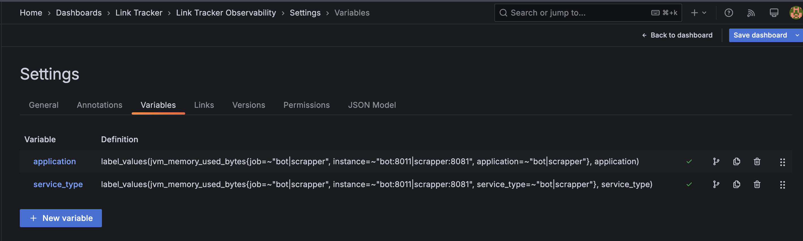

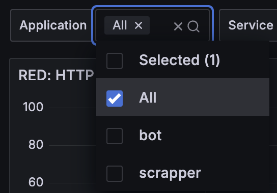

### 2. Service Type variable

```
label_values(jvm_memory_used_bytes{job=~"bot|scrapper", instance=~"bot:8011|scrapper:8081", service_type=~"bot|scrapper"}, service_type)
```

Получает список типов сервисов для фильтра `Service Type`.

*РЕЗУЛЬТАТ*


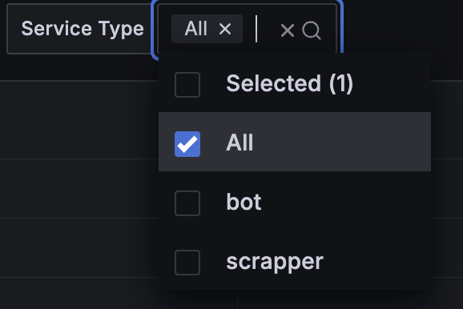

### 3. RED: HTTP request rate

```
sum by (application) (
  rate(http_server_requests_seconds_count{
    job=~"bot|scrapper",
    instance=~"bot:8011|scrapper:8081",
    application=~"bot|scrapper",
    service_type=~"bot|scrapper",
    uri!="/metrics"
  }[1m])
)
```

Показывает количество HTTP-запросов в секунду по приложениям.
*Примечание*
Эндпоинт `/metrics` исключен, чтобы Prometheus scrape не учитывался как пользовательский.

*РЕЗУЛЬТАТ*

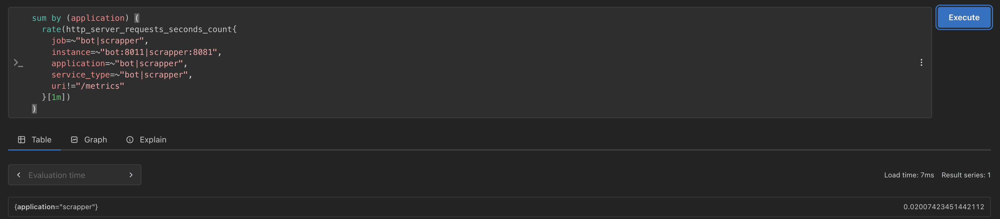

### 4. RED: HTTP errors rate

```
sum by (application, status) (
  rate(http_server_requests_seconds_count{
    job=~"bot|scrapper",
    instance=~"bot:8011|scrapper:8081",
    application=~"bot|scrapper",
    service_type=~"bot|scrapper",
    status=~"4..|5..",
    uri!="/metrics"
  }[1m])
)
```

Показывает количество HTTP 4xx/5xx ошибок в секунду по приложениям и HTTP-статусам.

*РЕЗУЛЬТАТ*

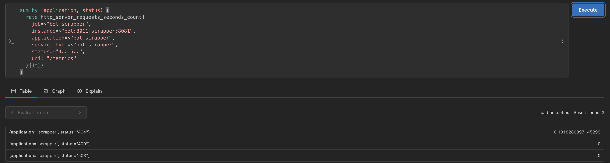

### 5. RED: HTTP p95 latency

```
histogram_quantile(
  0.95,
  sum by (le, application) (
    rate(http_server_requests_seconds_bucket{
      job=~"bot|scrapper",
      instance=~"bot:8011|scrapper:8081",
      application=~"bot|scrapper",
      service_type=~"bot|scrapper",
      uri!="/metrics"
    }[5m])
  )
)
```

Показывает p95 latency HTTP-запросов.

*Примечание:*
p95 означает, что 95% запросов выполняются быстрее этого значения.

*РЕЗУЛЬТАТ*

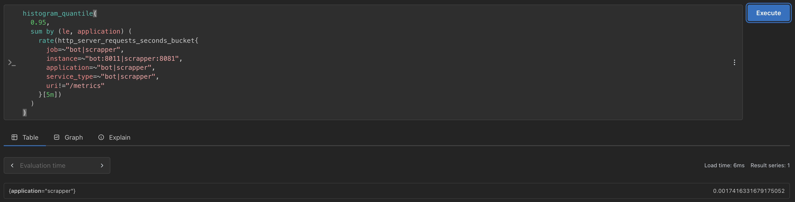

### 6. JVM memory used

```
sum by (application, area) (
  jvm_memory_used_bytes{
    job=~"bot|scrapper",
    instance=~"bot:8011|scrapper:8081",
    application=~"bot|scrapper",
    service_type=~"bot|scrapper"
  }
)
```

Показывает используемую JVM-память с разделением на `heap` и `nonheap`.

*РЕЗУЛЬТАТ*

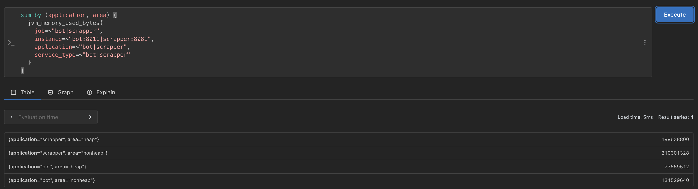

### 7. Bot command requests rate

```
sum by (command) (
  rate(command_requests_total{
    job="bot",
    instance="bot:8011",
    application="bot",
    service_type="bot"
  }[1m])
)
```

Показывает количество обработанных команд Bot в секунду с группировкой по команде.

*РЕЗУЛЬТАТ*

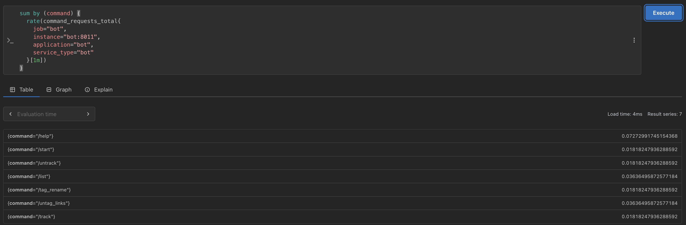

### 8. Tracked links by source

```
sum by (tracked_source) (
  links_on_track{
    job="scrapper",
    instance="scrapper:8081",
    application="scrapper",
    service_type="scrapper"
  }
)
```

Показывает количество активных ссылок в БД по источнику.
*Примечание*
Используется Pull-метрика напрямую из Scrapper.
(Аналогичный запрос через pushgateway находится под номером 19.)

*РЕЗУЛЬТАТ*

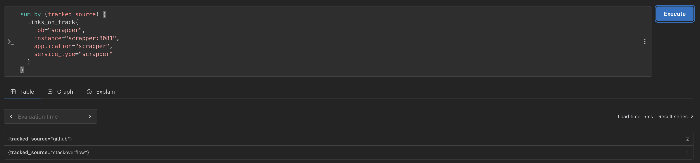

### 9. Scrapper scrape duration p50 by source

```
histogram_quantile(
  0.50,
  sum by (le, scope_type) (
    rate(request_duration_ms_total_milliseconds_bucket{
      job="scrapper",
      instance="scrapper:8081",
      application="scrapper",
      service_type="scrapper",
      scope="external_source"
    }[5m])
  )
)
```

Показывает p50 длительности scrape-операций по внешнему источнику.

*РЕЗУЛЬТАТ*

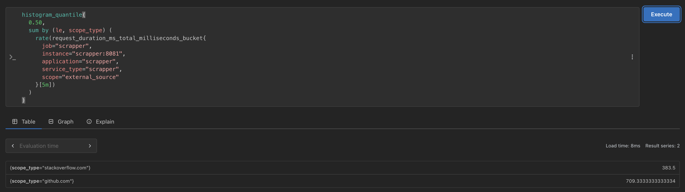

### 10. Scrapper scrape duration p95 by source

```
histogram_quantile(
  0.95,
  sum by (le, scope_type) (
    rate(request_duration_ms_total_milliseconds_bucket{
      job="scrapper",
      instance="scrapper:8081",
      application="scrapper",
      service_type="scrapper",
      scope="external_source"
    }[5m])
  )
)
```

Показывает p95 длительности scrape-операций по внешнему источнику.

*РЕЗУЛЬТАТ*

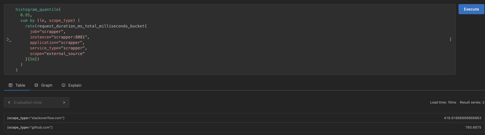

### 11. Scrapper scrape duration p99 by source

```
histogram_quantile(
  0.99,
  sum by (le, scope_type) (
    rate(request_duration_ms_total_milliseconds_bucket{
      job="scrapper",
      instance="scrapper:8081",
      application="scrapper",
      service_type="scrapper",
      scope="external_source"
    }[5m])
  )
)
```

Показывает p99 длительности scrape-операций по внешнему источнику.

*РЕЗУЛЬТАТ*

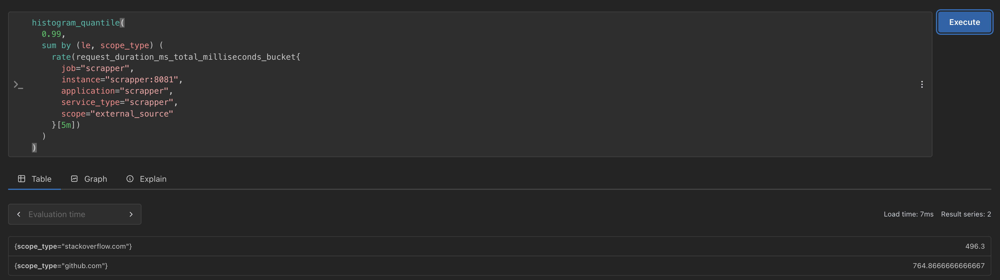

### 12. Bot command duration p50

```
histogram_quantile(
  0.50,
  sum by (le, scope_type) (
    rate(command_duration_ms_total_milliseconds_bucket{
      job="bot",
      instance="bot:8011",
      application="bot",
      service_type="bot",
      scope="telegram_command"
    }[5m])
  )
)
```

Показывает p50 времени обработки Telegram-команд.

*РЕЗУЛЬТАТ*

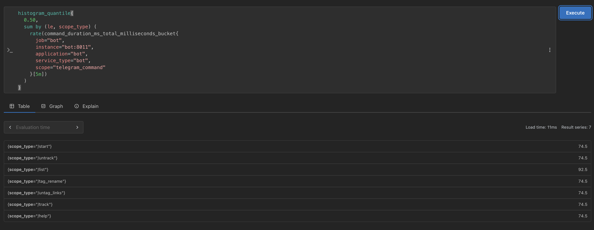

### 13. Bot command duration p95

```
histogram_quantile(
  0.95,
  sum by (le, scope_type) (
    rate(command_duration_ms_total_milliseconds_bucket{
      job="bot",
      instance="bot:8011",
      application="bot",
      service_type="bot",
      scope="telegram_command"
    }[5m])
  )
)
```

Показывает p95 времени обработки Telegram-команд.

*РЕЗУЛЬТАТ*

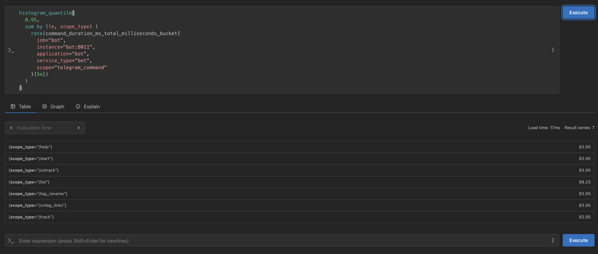

### 14. Bot command duration p99

```
histogram_quantile(
  0.99,
  sum by (le, scope_type) (
    rate(command_duration_ms_total_milliseconds_bucket{
      job="bot",
      instance="bot:8011",
      application="bot",
      service_type="bot",
      scope="telegram_command"
    }[5m])
  )
)
```

Показывает p99 времени обработки Telegram-команд.

*РЕЗУЛЬТАТ*

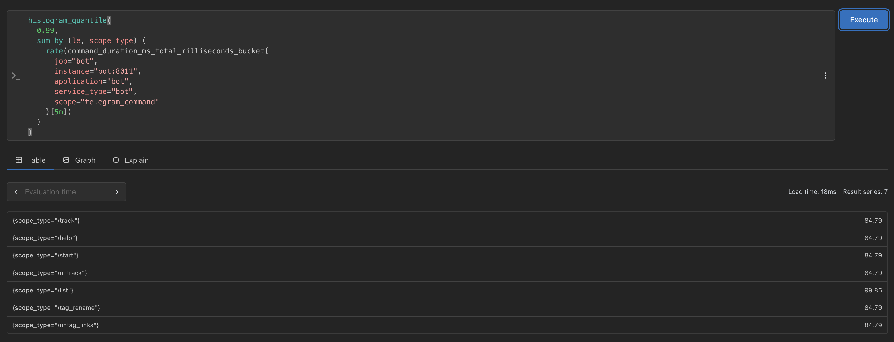

### 15. Telegram bot requests

```
sum by (request_type) (
  rate(telegram_requests_total{
    job="bot",
    instance="bot:8011",
    application="bot",
    service_type="bot"
  }[1m])
)
```

Показывает количество входящих Telegram-запросов/сообщений в секунду по типу запроса.

*РЕЗУЛЬТАТ*

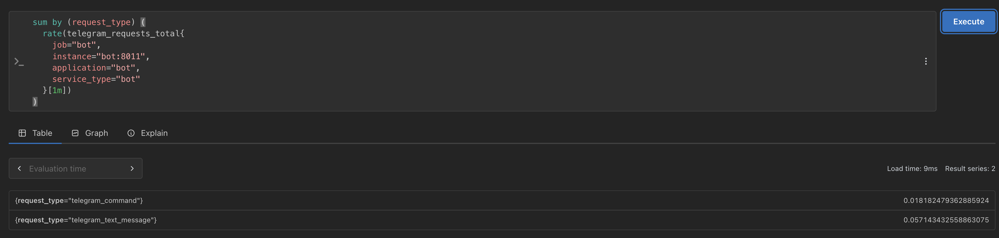

### 16. Sent notifications

```
sum(
  rate(sent_notification_total{
    job="bot",
    instance="bot:8011",
    application="bot",
    service_type="bot"
  }[1m])
)
```

Показывает количество отправленных Telegram-уведомлений в секунду.

*РЕЗУЛЬТАТ*

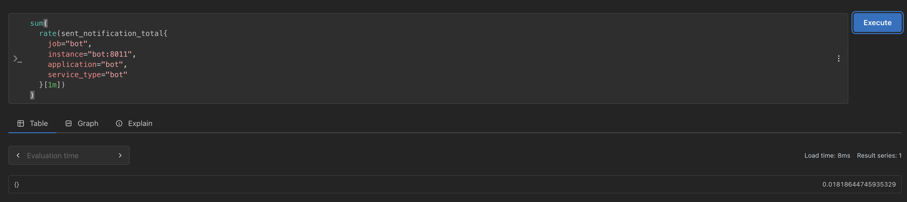

### 17. Scrapper API requests by source

```
sum by (source) (
  rate(api_requests_total{
    job="scrapper",
    instance="scrapper:8081",
    application="scrapper",
    service_type="scrapper"
  }[1m])
)
```

Показывает количество входящих HTTP-запросов к API Scrapper по источнику.

*РЕЗУЛЬТАТ*

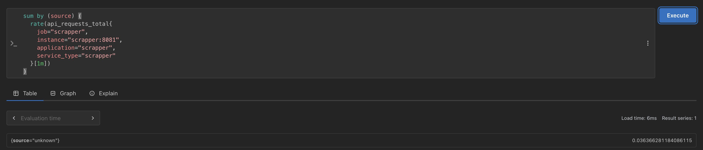

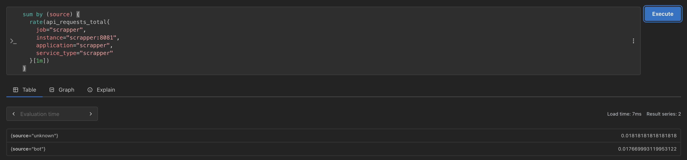
По умолчанию заголовок не отправляется. Чтобы воссоздать этот сценарий нужно поднять контейнеры.

Шаг 1

```
docker compose build --no-cache
```

Шаг 2

```
docker compose up
```

Шаг 3

```
curl -H "Tg-Chat-Id: 123456789" -H "X-Service-Name: bot" http://localhost:8081/links
```

*Примечание*

Если не отображать логи контейнера то с флагом -d. (На 2 шаге)

```
docker compose up -d
```

### 18. Scrapper component duration p95

```
histogram_quantile(
  0.95,
  sum by (le, scope, scope_type) (
    rate(request_duration_ms_total_milliseconds_bucket{
      job="scrapper",
      instance="scrapper:8081",
      application="scrapper",
      service_type="scrapper"
    }[5m])
  )
)
```

Показывает p95 длительности операций Scrapper по компонентам: БД, Kafka, внешние источники, API Bot.

*РЕЗУЛЬТАТ*

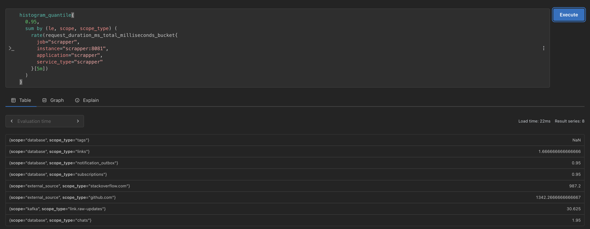

### 19. Pushgateway: tracked links by source

```
sum by (tracked_source) (
  links_on_track{
    job="scrapper",
    instance="",
    application="scrapper",
    service_type="scrapper"
  }
)
```

Показывает количество активных ссылок в БД по источнику, полученное через Pushgateway.

*Примечание*
Используется `instance=""`, чтобы брать pushed-метрики.
(Аналогичный запрос через pull модель напрямую из Scrapper находится под номером 8)

*РЕЗУЛЬТАТ*

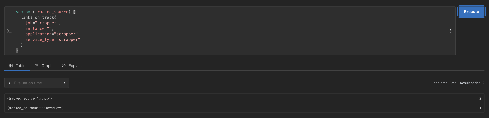

## Grafana Alert

Добавлен alert:

```
High JVM heap memory usage
```

Alert отслеживает процент использования heap-памяти JVM.

PromQL:

```
sum by (application) (
  jvm_memory_used_bytes{
    job=~"bot|scrapper",
    instance=~"bot:8011|scrapper:8081",
    area="heap",
    application=~"bot|scrapper"
  }
)
/
sum by (application) (
  jvm_memory_max_bytes{
    job=~"bot|scrapper",
    instance=~"bot:8011|scrapper:8081",
    area="heap",
    application=~"bot|scrapper"
  }
)
* 100
```

Если значение превышает 80%, Grafana переводит alert в состояние предупреждения.
*Примечание*
Для Java-приложений heap является основной управляемой областью памяти,
где размещаются объекты приложения. Поэтому alert на потребление памяти построен на проценте использования JVM heap memory.
Dashboard также содержит визуализацию `JVM memory used` с разделением на `heap` и `nonheap`.

*РЕЗУЛЬТАТ*

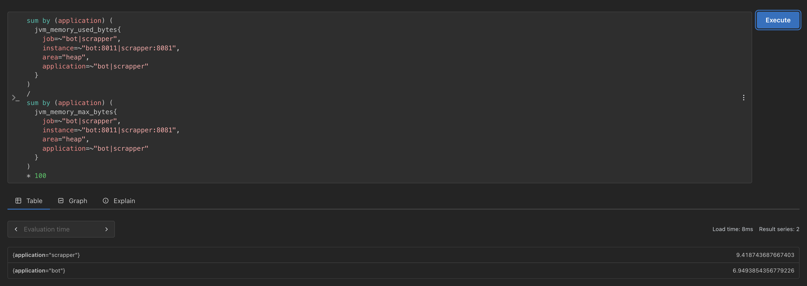
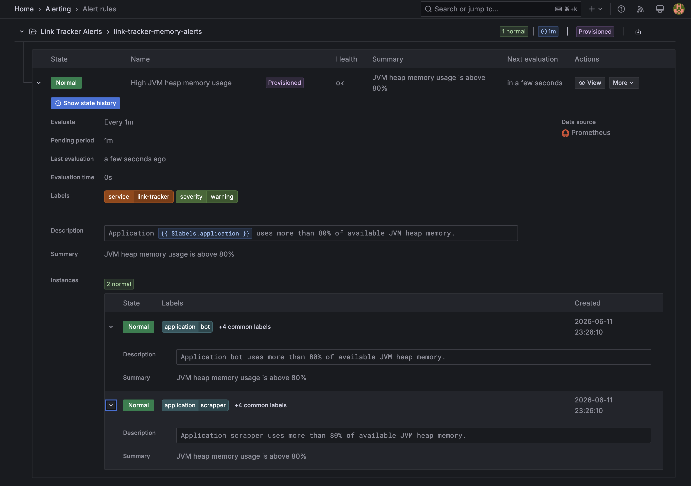

## Pushgateway

Pushgateway добавлен для дополнительной Push-модели передачи метрик.
Приложения отправляют метрики в:

```
pushgateway:9091
```

Prometheus затем собирает их из:

```
pushgateway:9091/metrics
```

Проверочный запрос для Bot:

```
command_requests_total{
  job="bot",
  application="bot",
  instance=""
}
```

Проверочный запрос для Scrapper:

```
request_duration_ms_total_milliseconds_count{
  job="scrapper",
  application="scrapper",
  instance=""
}
```

`instance=""` означает, что метрика пришла через Pushgateway, а не напрямую из `/metrics` приложения.

## Запуск и проверка мониторинга

### Если проект еще не запускался в контейнерах

Шаг 1
Файл `.env.example` переименовать в `.env` и заполнить своими значениями

Шаг 2

```
docker compose up -d --build
```

### Если проект уже запускался в контейнерах

Шаг 1

```
docker compose build --no-cache
```

Шаг 2

```
docker compose up
```

### Проверка

Проверка Prometheus targets:

```
http://localhost:9090/targets
```

Ожидаемые targets:

```
scrapper
bot
pushgateway
```

Все targets должны быть в состоянии `UP`.

Grafana:

```
http://localhost:3000
```

Prometheus:

```
http://localhost:9090
```

Pushgateway:

```
http://localhost:9091
```

## Проверка метрик

Проверка Prometheus:

```
up
```

Проверка Scrapper business metrics:

```
links_on_track
```

```
api_requests_total
```

```
request_duration_ms_total_milliseconds_bucket
```

Проверка Bot business metrics:

```
command_requests_total
```

```
command_duration_ms_total_milliseconds_bucket
```

```
telegram_requests_total
```

```
sent_notification_total
```

Проверка Pushgateway:

```
links_on_track{
  job="scrapper",
  instance=""
}
```

```
command_requests_total{
  job="bot",
  instance=""
}
```

